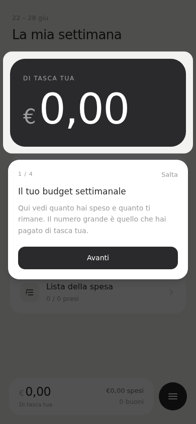
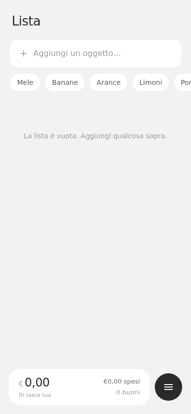
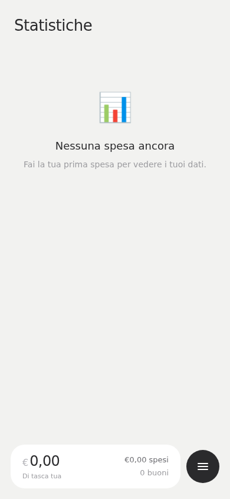
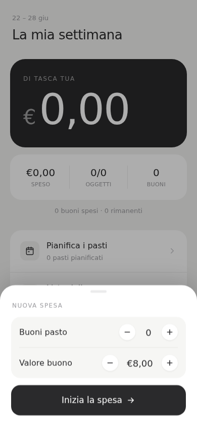

<div align="center">
  
  <h1>Spesa</h1>
  <p>
    Manage your weekly grocery shopping with meal vouchers — local-first, no account needed.
  </p>

  
  
  
  

  **[→ Open the app](https://spesa.matteogranzotto.com)**

  [🇮🇹 Italiano](README.md) · 🇬🇧 English
</div>

---

<div align="center">
  <table>
    <tr>
      <td align="center"></td>
      <td align="center"></td>
      <td align="center"></td>
      <td align="center"></td>
    </tr>
    <tr>
      <td align="center"><sub>Home</sub></td>
      <td align="center"><sub>List</sub></td>
      <td align="center"><sub>Statistics</sub></td>
      <td align="center"><sub>New shopping trip</sub></td>
    </tr>
  </table>
</div>

---

## About

Spesa is a personal project I built for myself and later open-sourced.
It manages weekly grocery shopping with meal vouchers: tracks spending, voucher usage,
and how much comes out of pocket. Everything is stored locally on your device — no account,
no server. It installs as a native app on iOS, Android, and desktop.

## Features

- 🛒 Shopping list with quantity stepper and autocomplete
- 💶 Weekly meal voucher budget
- 📊 Statistics: weekly trend, top items, category breakdown
- 📈 Price change indicator vs last purchase
- ✨ Load your usual shopping in one tap
- 🗓️ Weekly meal planner
- 🏪 Supermarkets with loyalty card
- 🔄 Optional backup to GitHub (JSON in a private repo)
- 📱 Installable PWA — iOS · Android · Desktop
- 🌍 Italian · English

## Stack

Vite · React · TypeScript · TanStack Router · TanStack Query · Dexie (IndexedDB) · Tailwind CSS · Vaul · Sonner

## Getting Started

```bash
git clone https://github.com/Blundert/spesa.git
cd spesa
npm install
npm run dev
```

Single-user app: data lives in the browser's IndexedDB, no environment variables needed.

## License

MIT — see [LICENSE](LICENSE).
