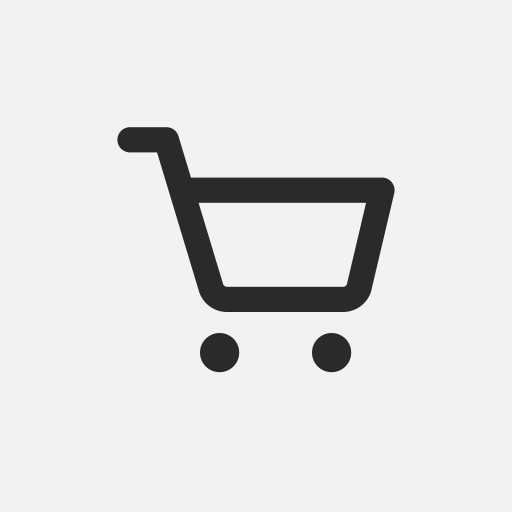
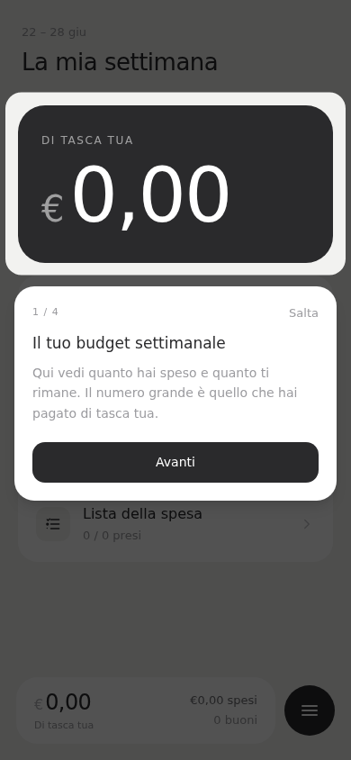
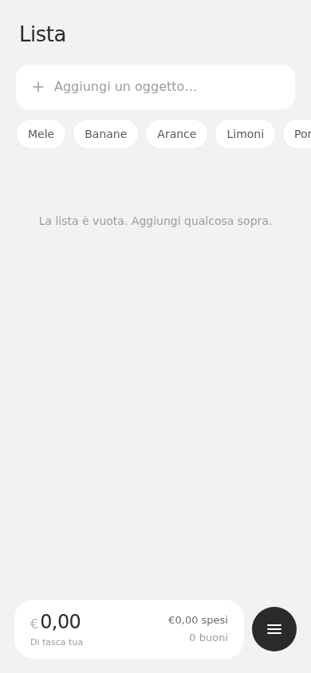
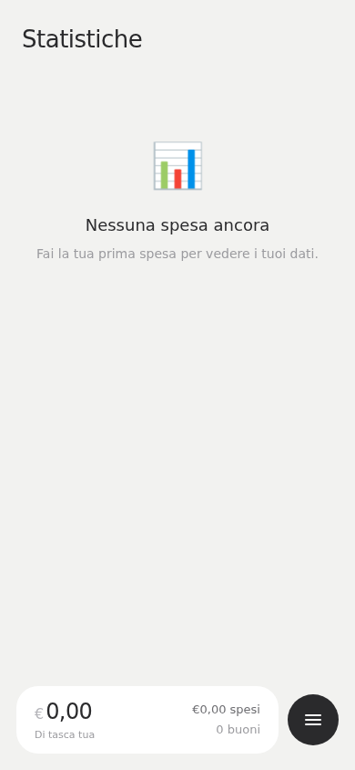
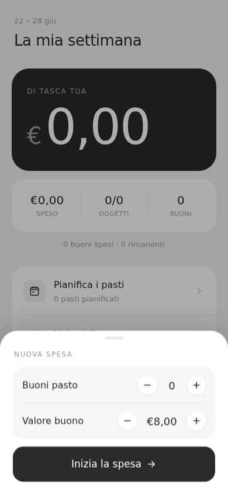

<div align="center">
  
  <h1>Spesa</h1>
  <p>
    Gestisci la spesa settimanale con i buoni pasto — tutto in locale, senza account.<br>
    Manage your weekly grocery shopping with meal vouchers — local-first, no account needed.
  </p>

  
  
  
  

  **[→ Apri l'app / Open the app](https://spesa.matteogranzotto.com)**
</div>

---

<div align="center">
  <table>
    <tr>
      <td align="center"></td>
      <td align="center"></td>
      <td align="center"></td>
      <td align="center"></td>
    </tr>
    <tr>
      <td align="center"><sub>Home</sub></td>
      <td align="center"><sub>Lista</sub></td>
      <td align="center"><sub>Statistiche</sub></td>
      <td align="center"><sub>Nuova spesa</sub></td>
    </tr>
  </table>
</div>

---

## Il Progetto / About

**IT —** Spesa è un progetto personale che ho costruito per me stesso e poi reso open source.
Gestisce la spesa settimanale tenendo conto dei buoni pasto: tiene traccia di quanto spendo,
quanti buoni uso e quanto pago di tasca mia. Tutto viene salvato in locale sul telefono,
senza account né server. È installabile come app nativa su iOS, Android e desktop.

**EN —** Spesa is a personal project I built for myself and later open-sourced.
It manages weekly grocery shopping with meal vouchers: tracks spending, voucher usage,
and how much comes out of pocket. Everything is stored locally on your device — no account,
no server. It installs as a native app on iOS, Android, and desktop.

## Funzionalità / Features

- 🛒 Lista della spesa con stepper quantità e autocompletamento · Shopping list with quantity stepper and autocomplete
- 💶 Budget buoni pasto settimanale · Weekly meal voucher budget
- 📊 Statistiche: andamento settimanale, top articoli, ripartizione per categoria · Statistics: weekly trend, top items, category breakdown
- 📈 Indicatore variazione prezzo rispetto all'ultima volta · Price change indicator vs last purchase
- ✨ Carica la tua "spesa solita" in un tap · Load your usual shopping in one tap
- 🗓️ Pianificatore pasti settimanale · Weekly meal planner
- 🏪 Supermercati con tessera fedeltà · Supermarkets with loyalty card
- 🔄 Backup opzionale su GitHub (JSON in repo privata) · Optional backup to GitHub (JSON in a private repo)
- 📱 PWA installabile — iOS · Android · Desktop · Installable PWA — iOS · Android · Desktop
- 🌍 Italiano · English

## Stack

Vite · React · TypeScript · TanStack Router · TanStack Query · Dexie (IndexedDB) · Tailwind CSS · Vaul · Sonner

## Getting Started

```bash
git clone https://github.com/Blundert/spesa.git
cd spesa
npm install
npm run dev
```

App single-user: i dati vivono nell'IndexedDB del browser, nessuna variabile d'ambiente richiesta.  
Single-user app: data lives in the browser's IndexedDB, no environment variables needed.

## License

MIT — see [LICENSE](LICENSE).
